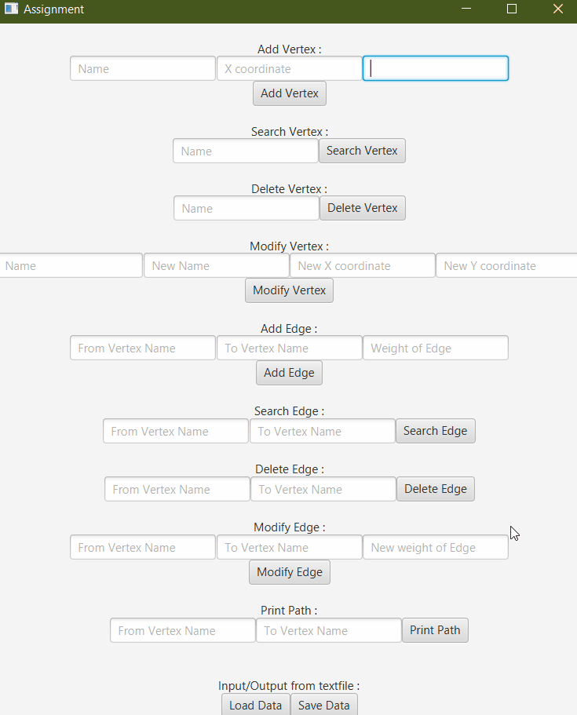
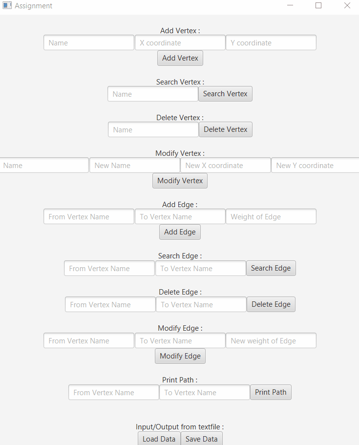

# Javafx

This folder contains code for everything asked in the questions given below. To run these codes you must have Javafx libraries installed.

## Questions

1. Make a program to make the following functionalities 
	* Add vertex specifying name of vertex, x coordinate value and y coordinate value using text fields
	* Search for a named vertex and show details
	* Delete a named vertex
	* Modify the details of a named vertex,
	* Add edge specifying from and to vertices names and weight using text fields
	* Search for an edge specifying the named vertices
	* Delete an edge
	* Modify the details of an edge
	* Load data from a text file (format: number of vertices, vertex details, number of edges, edge details, all space separated in a single line)
	* Export graph in the same format in a text file (vertices sorted by name, edges sorted from the from vertex and then to vertex)
	* Take source and goal vertex name as input and print the path in a text field.

2. In question 1, use Dialogue Boxes on an illegal input. Use exception handling.

3. In question 1, allow the user to click to add vertices, select and press a key to delete vertices,
drag to move vertices in the vertex mode. In a similar edge move, allow to draw edges by
mouse, select and delete edges by a key. Use a suitable interface to add and alter edge costs.
Display the graph. Show the output of the Dijkstra’s algorithm on queried source and goal on
the graph itself.

4. In question 3, instead of showing the path by a line, animate a circle travelling on the output
path to show the path. The animation should continuously restart itself.

5. In question 4, let the user choose the shape instead of a circle to be used for animation (give
options of square, plus, cross and triangle). Also allow the user to animate a number of paths,
each computed using Dijkstra’s algorithm as a query. Use inheritance to handle shapes.

## Sample Text Input File (Used in Q1)

3

A 10 10

B 15 10

C 20 15

6

A B 10

A C 8

B A 10

B C 5

C A 8

C B 5